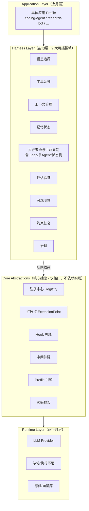
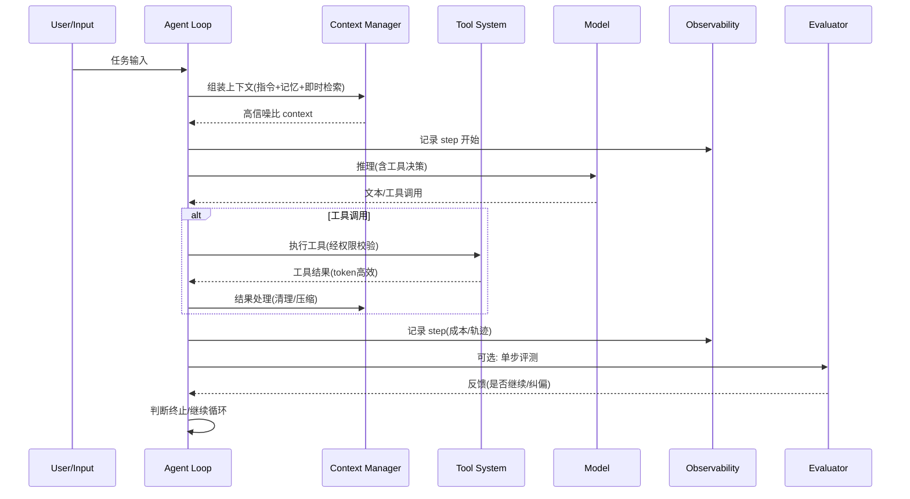

# AgentConch 技术方案

> **项目代号**：agent-conch
> **定位**：Agent Harness Engineering 技术实践平台
> **文档版本**：v0.3（基于 v0.2 架构改进建议落地）
> **最后更新**：2026-06-26

---

## 0. TL;DR

AgentConch 是一个**以可扩展性为核心设计目标**的 Agent 实践平台，用来系统性落地 Harness Engineering 中的各类技术项目。它的核心主张是：

> **Agent = Model + Harness。模型是 CPU，Harness 是操作系统。** 当模型能力趋于稳定，任务执行的可靠性越来越取决于模型外层的那层工程。

为此，AgentConch 把 Harness 拆解为 **9 大能力域**，每个能力域定义稳定接口、支持插件化实现，并配套**注册中心 + Profile + 实验框架**三件套，使得"接入一个新技术点"等同于"写一个插件 + 一行注册"，对核心零侵入。对于尚未出现的技术维度，则通过**自定义能力域 + Hook + 中间件**三重逃生口保证不被接口固化卡住。

**v0.2 关键变更**（基于 v0.1 评审）：
- **安全 day-one**：沙箱 + 权限校验进入 MVP，审计日志前置到阶段 1.5
- **收敛 MVP**：从 7 域缩减为 4 域最小闭环，增加阶段 1.5 与量化退出标准
- **Registry 增强**：依赖声明 + 生命周期钩子 + 运行时发现 + 版本共存
- **多 Agent 协作抽象**：主从 / 并行 / GAN 三种模式接口 + 并发控制
- **记忆对齐五分法**：短期 / 情景 / 语义 / 长期 / 程序性
- **补 streaming + cost guard**：流式输出与 token budget 守卫内建
- **跨平台兼容**：uvloop 条件导入，Windows 退化为标准 asyncio
- **明确与 LangGraph 关系**：自建 Loop，LangGraph 作为编排域可选插件（见第 13 节）

**v0.3 关键变更**（基于 v0.2 架构改进建议，复杂度与完备性取舍后落地）：
- **依赖倒置澄清**：核心层仅定义接口契约，9 域反向依赖核心，不反向耦合
- **合并编排层**：取消独立 Orchestration Layer，编排能力全部收敛到域5插件
- **Hook 三大约束固化**：职责隔离（Hook 只副作用/中间件只数据流）+ 优先级 + 中断节点白名单
- **Profile 继承与校验**：`extends` 语法 + Pydantic 全量校验 + 环境变量覆盖
- **沙箱加固基线**：CPU/内存/网络限制、禁特权、只读挂载进入 MVP
- **Agent 自观测**：核心指标封装为只读工具（轻量版）
- **四级指标集**：执行/成本/效果/健康，MVP 先做执行+成本
- **标准基准对接**：SWE-bench / MT-Bench 原生集成，保证横向可比
- **MCP 对齐强化**：工具域核心接口对齐 MCP 规范 + 插件导出 MCP（延后）
- **成本分级降级**：L1 压缩 → L2 切模型 → L3 禁工具(延后) → L4 终止
- **OrchestrationMode 接口预留**：task_split / state_sync / conflict_resolve（L3 实现）
- **明确延后项**：资源池调度、语义化版本约束、签名校验、RBAC、审计哈希防篡改、预算分组、配置中心 → L4 企业级

---

## 1. 项目概述

### 1.1 命名寓意

**Conch（海螺）**：海螺的外壳是天然的 harness——内部空腔让声波（模型推理）共振放大，外壳提供结构约束与保护。正如 Harness 包裹 Model：外壳塑形、内部共振。

致敬《蝇王》中的海螺：它是"发言权与秩序"的象征。Harness Engineering 的本质，正是给原始的模型能力赋予秩序、边界与可恢复性。

### 1.2 目标

| 目标 | 说明 |
|---|---|
| **实践 harness 技术矩阵** | 系统性落地信息边界、工具系统、上下文管理、记忆、编排、评估、可观测、约束恢复、治理等 9 大能力域的技术点 |
| **可扩展性优先** | AI Agent 领域技术更新极快，新技术点能以最低成本接入，核心不动 |
| **实验友好** | 任意技术点可 A/B 对比，量化不同 harness 配置对效果/成本的影响 |
| **简洁通用** | 架构师视角的通用设计，反对过度工程，内核极简 |

### 1.3 非目标

- **不做** 一个面向终端用户的产品型 Agent（它是实验/研究底座，应用层由具体 Profile 定义）
- **不重新发明** LLM SDK、沙箱、向量库等基础设施（选成熟组件，只做 harness 这层）
- **不追求** 大而全的开箱即用（默认实现够用即可，重点在扩展机制）

---

## 2. 背景：Harness Engineering 范式

### 2.1 Agent = Model + Harness

Harness 指模型之外的**整套系统**：系统提示词、工具调用、文件系统、沙箱、编排逻辑、钩子中间件、反馈回路、约束机制。模型只提供推理与生成，Harness 把状态、工具、反馈、执行环境和安全边界串起来，Agent 才能真正干活。

> 可以把模型想成 CPU，把 Harness 想成操作系统。CPU 再强，OS 如果天天崩，体验也不会好。

一个关键论断：**在不改模型权重的情况下，仅调整 harness 层，也能显著改变 Agent 在 coding / terminal benchmark 上的表现。** 这正是 Harness Engineering 值得系统性实践的原因。

### 2.2 三层演进

| 阶段 | 时间 | 核心问题 | 关注点 |
|---|---|---|---|
| Prompt Engineering | 2022–2024 | 怎么把指令说清楚 | 单次调用的输入优化 |
| Context Engineering | 2025 | 该给 Agent 看什么 | 在合适时机给模型正确且必要的信息 |
| **Harness Engineering** | 2026 | 系统怎么持续执行、纠偏、观测、恢复 | 长链路任务的可靠性、故障恢复、约束执行 |

三者不是替代，而是**分层协作**：Prompt 处理表达，Context 处理信息环境，Harness 处理系统可靠性。2026 年，Harness 成为 AI 应用差异化的关键。

### 2.3 一线团队的实战信号

- **OpenAI**：3→7 人，5 个月，~100 万行代码，0 行手写。核心是"地图式文档 + 机械化架构约束（不可机械执行的就一定会偏离）+ 可观测性给 Agent 看 + 主动对抗熵增"。
- **Anthropic**：三智能体 GAN 架构（Planner → Generator ⇄ Evaluator），Context Resets 机制（接近饱和时结构化交接、重启干净 Agent），生成与评估分离以对抗自我评价偏差。
- **Stripe**：每周 1300+ 无人值守 PR。Devbox + 编排状态机（确定性节点与 Agent 节点混合）+ 集中式 MCP（~500 工具按需筛选）+ 反馈回路。

**共同启示**：Harness 中每个组件都编码了"模型不能独立完成什么"的假设，而这些假设值得持续压力测试——模型变强后，已有 harness 应定期简化。

---

## 3. 设计目标与原则

### 3.1 核心原则

1. **可扩展性 > 功能完备性**。宁可能力域接口稳定但实现少，也不要接口臃肿却难以扩展。
2. **安全 day-one**。沙箱与权限校验是 MVP 的底线，不是远期功能。Agent 能执行 bash 的第一天，就必须有权限分级与审计。
3. **插件化一切**。9 大能力域的每一个技术点都是可插拔组件，可独立开发、替换、对比。
4. **配置即实验**。一组插件 + 参数 = 一个实验配置（Profile），切换配置即可切换实验。
5. **渐进式披露**。借鉴 Anthropic 的上下文哲学：核心最小化，细节按需加载，反对一开始就搭齐六层。
6. **可观测内建**。轨迹、成本、失败信号从第一天就接入，评测与可观测性是同一反馈回路。
7. **反对过度工程**。接口够用即可，不为想象中的需求提前抽象。MVP 用最小域集跑通闭环，按需补层。

### 3.2 成熟度参考

设计参考 Harness 成熟度阶段，AgentConch 从 Level 1 起步，目标支撑到 Level 3：

| 阶段 | 特征 | AgentConch 对应 |
|---|---|---|
| L0 无 Harness | 直接 Prompt | — |
| L1 基础约束 | AGENTS.md、Linter、手动测试 | **MVP 起步** |
| L2 反馈回路 | CI 集成、自动化测试、进度追踪 | 阶段二 |
| L3 专业化 Agent | 多 Agent 分工、分层上下文、持久记忆 | 阶段三 |
| L4 自治循环 | 无人值守并行、自动清理、自修复 | 远期 |

---

## 4. Harness 技术矩阵

融合"六层架构"与"ETCLOVG 七层体系"，形成 **9 大能力域**。前 4 域是**结构核心**，后 5 域是**控制平面**。这是 AgentConch 要实践的技术项目清单。

> 每个域标注成熟度：🟢 生态成熟 / 🟡 半成熟 / 🔴 生态薄弱（机会区）

### 域 1 · 信息边界与指令系统（Information Boundary）🟢

决定 Agent 该知道什么、不该知道什么。

| 技术点 | 说明 | 参考实践 |
|---|---|---|
| AGENTS.md 指令文件 | 只当目录不当超级 Prompt，约 100 行，指向深层文档 | OpenAI / Hashimoto |
| 系统提示词结构化 | XML/Markdown 分段，"正确高度"（不脆弱不模糊） | Anthropic |
| 渐进式披露 | 关键信息先给，按需加载深层文档 | OpenAI 地图式文档 |
| 角色与目标裁剪 | 定义 Agent 身份，裁剪无关上下文 | — |
| 指令版本化 | 指令作为版本控制制品 | OpenAI 仓库即事实来源 |
| **Skill 加载（按需指令包）** | 触发词匹配 → 动态注入指令片段 + 绑定工具 + 参考资源 | Anthropic Skills / SKILL.md 规范 |
| Skill 触发匹配 | 基于任务/关键词的 skill 选择与加载 | Anthropic Skills |
| Skill 与指令分层 | AGENTS.md=常驻目录，Skill=按需技能包，互不污染 | 渐进式披露 |

#### Skill 系统（作为域1插件实现）

Skill 本质是比"指令"和"工具"高一层的东西——把"触发条件 + 指令片段 + 可选工具绑定 + 可选参考资源"打包成可复用单元，按任务动态加载。它横跨域1（指令）/域2（工具）/域5（编排），但核心职责是"按需注入指令"，故作为**域1的插件**实现，对核心零侵入。

```python
# domains/information/skill_loader.py
@registry.register("information", "skill_loader", "1.0")
class SkillLoader:
    """域1插件：按任务匹配并加载 SKILL.md 技能包"""
    metadata = {"cost": "low", "trigger": "keyword/task_match"}

    def __init__(self, skill_dir: str):
        self.skills = self._index_skills(skill_dir)   # 扫描 SKILL.md，建触发词索引

    def assemble(self, task, state) -> "Context":
        matched = self._match(task, state)             # 触发词/任务类型匹配
        for skill in matched:
            state.inject(skill.instructions)            # 注入指令片段
            state.bind_tools(skill.tools)               # 绑定 skill 声明的工具
            # references/ 资源按 JIT 原则不预加载，Agent 自行检索
        return state.context
```

**分层原则**：AGENTS.md 是常驻目录（~100 行，告诉 Agent 有哪些技能可调用），Skill 是按需技能包（仅在匹配时注入），二者职责分离、互不污染上下文。这与 Anthropic 渐进式披露、OpenAI 地图式文档理念一致。

**兼容 SKILL.md 规范**：skill_loader 直接索引符合标准 SKILL.md 结构（含触发词、Iron Rules、references/）的技能包，因此 agent-conch 既能加载外部 skill，也可产出 skill 反哺通用技能仓库。

### 域 2 · 工具系统与协议（Tool System）🟢

Agent 与外部世界交互的接口。

| 技术点 | 说明 | 参考实践 |
|---|---|---|
| 工具注册与发现 | 统一注册中心，运行时筛选子集 | Stripe Toolshed |
| MCP 原生对齐 | 工具域核心接口对齐 MCP 协议规范，原生支持 MCP Server 直连，无需额外适配 | Anthropic / Stripe |
| 插件导出 MCP | AgentConch 插件可导出为 MCP Server，复用到其他生态 | 生态协同（延后） |
| 最小可行工具集 | 工具自包含、容错、无功能重叠 | Anthropic |
| 工具结果处理 | 即时上下文、工具结果清理、token 高效返回 | Anthropic Tool Result Clearing |
| 工具为 Agent 设计 | 接口面向 Agent 而非人用 API | Anthropic 核心理念 |
| 通用执行环境 | Bash / 代码执行沙箱 | OpenAI / Carlini |

### 域 3 · 上下文管理（Context Management）🟡

决定模型在短期/会话级/持久化层面能看到什么。

| 技术点 | 说明 | 参考实践 |
|---|---|---|
| 即时上下文（Just-in-Time） | 保留轻量引用，运行时动态拉取 | Anthropic / Claude Code |
| 上下文压缩（Compaction） | 接近窗口上限时摘要蒸馏，高保真 | Anthropic |
| 工具结果清理 | 深层历史工具结果移除 | Claude Platform |
| Context Resets | 结构化交接文档 + 干净重启 | Anthropic 三智能体 |
| 40% 利用率阈值 | 超过 Smart Zone 触发压缩/分段 | Dex Horthy |
| 元数据信号利用 | 文件名/路径/时间戳作为相关性代理 | Anthropic |

### 域 4 · 记忆与状态（Memory & State）🟡

长任务中间结果与跨会话积累。

| 技术点 | 说明 | 参考实践 |
|---|---|---|
| 结构化笔记 | NOTES.md / To-do，写入窗口外持久化 | Anthropic |
| 记忆工具 | 基于文件的记忆系统，跨会话 | Anthropic Memory Tool |
| 进度文件 | JSON 追踪功能状态，结构化不易被乱改 | Anthropic 两阶段 |
| 短期/会话/持久三层 | 分层记忆，按生命周期管理 | Memory 统一分类体系 |
| 状态隔离 | 当前任务状态、中间产物、长期记忆独立管理 | 六层架构 L4 |

### 域 5 · 执行编排与生命周期（Orchestration）🟢

组织状态的读写控制流。**开源生态项目最多**。

| 技术点 | 说明 | 参考实践 |
|---|---|---|
| Agent Loop | LLM 在循环中自主使用工具 | Anthropic Agent 定义 |
| 多 Agent 协作 | 主从/并行/专业化分工 | Carlini 16 Agent |
| GAN 式架构 | Planner → Generator ⇄ Evaluator | Anthropic |
| 状态机编排 | 确定性节点 + Agent 节点混合 | Stripe |
| Sprint 机制 | 按功能分 Sprint，明确完成标准 | Anthropic |
| 测试子采样 | 每个 Agent 跑随机子集，整体全覆盖 | Carlini |
| 可恢复执行 | 长任务断点续跑 | Anthropic 执行基础设施 |

### 域 6 · 评估与验证（Evaluation）🟢

把任务和轨迹转化为评估、归因、回归反馈。

| 技术点 | 说明 | 参考实践 |
|---|---|---|
| 三层评测 | 单步 + 完整回合 + 多轮 | LangChain |
| 端到端验证 | Playwright/Puppeteer，像用户一样验证 | Anthropic |
| Evaluator Agent | 独立评估 Agent，对抗自我评价偏差 | Anthropic |
| 可重置环境 | 每次评测可复现 | LangChain |
| 打分权重设计 | 故意提高难度维度权重逼模型往上走 | Anthropic 前端实验 |

### 域 7 · 可观测性（Observability）🔴

捕获轨迹、成本、失败、可靠性信号。**生态薄弱，机会区**。

| 技术点 | 说明 | 参考实践 |
|---|---|---|
| 轨迹追踪 | 完整 step/tool/token 链路 | OpenTelemetry |
| 成本观测 | token/美元/延迟指标 | — |
| 给 Agent 看的可观测性 | 性能指标变成 Agent 可自测的 | OpenAI Chrome DevTools |
| Agent 自观测工具 | 核心指标封装为只读工具，Agent 可查询自身运行数据（step 数/已耗 token/成本） | OpenAI（轻量版，MVP） |
| 四级核心指标集 | 执行类/成本类/效果类/健康类，对齐 LangSmith 标准 | 业内通用（框架预留） |
| DOM 快照/截图 | 浏览器场景的可视化轨迹 | OpenAI |
| 链路追踪 | 跨 Agent/跨工具调用链 | — |

> **四级指标集成熟度划分**：MVP 先实现**执行类**（step 总数、工具调用成功率、Context Reset 次数、单步延迟）与**成本类**（token 消耗、模型费用）；**效果类**（任务成功率、评测得分、恢复率）随域6 评测体系补齐；**健康类**（权限越权、沙箱异常、插件加载失败率）随域9 治理补齐。

### 域 8 · 约束、校验与恢复（Constraint & Recovery）🟡

出错时拦截、重试、回滚、降级。

| 技术点 | 说明 | 参考实践 |
|---|---|---|
| 自定义 Linter + 修复指令 | 报错自带修复方法 | OpenAI P0 |
| 机械化架构约束 | 固定分层，依赖方向不可逆 | OpenAI |
| 安全沙箱 | 隔离风险执行 | — |
| 沙箱加固基线 | Docker 默认 CPU/内存/网络限制、禁用特权模式、只读挂载系统目录；Firecracker（Linux 可选）/ WSL2（Windows 可选）强隔离 | 安全 day-one |
| 权限边界 | 工具/文件/网络权限控制 | 治理层（MVP 用 allowlist） |
| 重试/回滚/降级 | 失败时提供恢复路径 | 六层架构 L6 |
| 垃圾回收 | 后台 Agent 定期清理冗余 | OpenAI 对抗熵增 |

### 域 9 · 治理（Governance）🔴

权限、身份、策略、审计、人工监督。**生态最薄弱**。

| 技术点 | 说明 | 参考实践 |
|---|---|---|
| 权限模型 | 工具调用权限分级 | — |
| 审计日志 | 不可篡改的操作记录 | — |
| 人工监督 | Human-in-the-loop 关键节点拦截 | — |
| 策略引擎 | 声明式安全策略 | — |

### 矩阵总览

```
结构核心                          控制平面
┌──────────────────────┐    ┌──────────────────────┐
│ 1 信息边界与指令  🟢  │    │ 6 评估与验证      🟢  │
│ 2 工具系统与协议  🟢  │    │ 7 可观测性        🔴  │ ← 机会区
│ 3 上下文管理      🟡  │    │ 8 约束校验与恢复  🟡  │
│ 4 记忆与状态      🟡  │    │ 9 治理            🔴  │ ← 机会区
│ 5 执行编排与生命周期🟢 │    │                      │
└──────────────────────┘    └──────────────────────┘
```

---

## 5. 整体架构

### 5.1 分层架构

> **依赖倒置原则**：核心抽象层（ExtensionPoint/Registry/Hook/Profile）**仅定义接口契约，不依赖任何具体能力域实现**。9 大能力域作为实现层，反向依赖核心抽象层。这保证核心层不被业务逻辑耦合，接口稳定而实现可变。



> **v0.3 变更**：取消 v0.2 中独立的 "Orchestration Layer" 层级——编排能力（Agent Loop、多 Agent 协作、状态机）全部收敛到**域5（执行编排与生命周期）**作为 ExtensionPoint 插件实现，保持全架构插件化逻辑统一，消除分层倒置与职责重叠。

### 5.2 一次 Agent Step 的数据流



---

## 6. 核心抽象与扩展机制（方案灵魂）

> 这一章回答最关键的问题：**新技术点出现时，如何零侵入接入？**

### 6.1 三层扩展模型

AgentConch 提供由浅入深的三层扩展方式，覆盖从"已知能力域的新实现"到"全新未知技术维度"：

| 层级 | 适用场景 | 机制 | 侵入性 |
|---|---|---|---|
| **L1 插件** | 在已有能力域内新增技术点（如新的压缩算法） | 实现域接口 + 注册 | 零侵入 |
| **L2 Hook / 中间件** | 在 Agent Loop 关键节点注入横切逻辑 | 挂载到 Hook 总线 / 中间件链 | 零侵入 |
| **L3 自定义能力域** | 出现全新的技术维度，9 域都装不下 | 注册新域 + 定义接口 | 仅声明，不改核心 |

**关键设计哲学**：能力域接口定义"做什么"（WHAT），绝不限定"怎么做"（HOW）。这样即使技术演进，接口依然稳定。

### 6.2 能力域与扩展点（ExtensionPoint）

每个能力域 = 一个 `ExtensionPoint`，定义稳定契约：

```python
# core/extension.py —— 核心扩展点抽象
from typing import Protocol, runtime_checkable

@runtime_checkable
class ExtensionPoint(Protocol):
    """所有能力域的基类契约。能力域只定义 WHAT，不定义 HOW。"""
    domain: str          # 能力域标识，如 "context"
    name: str            # 实现名，如 "compaction_v1"
    version: str         # 语义化版本
    metadata: dict       # 成本/上下文消耗/适用场景等自描述

class ContextManager(ExtensionPoint, Protocol):
    """域3：上下文管理扩展点"""
    def assemble(self, task, state) -> "Context": ...
    def compact(self, context, strategy) -> "Context": ...
    def should_compact(self, context) -> bool: ...

class ToolProvider(ExtensionPoint, Protocol):
    """域2：工具系统扩展点"""
    def tools_for(self, task, state) -> list["Tool"]: ...
    def execute(self, tool, args, perms) -> "ToolResult": ...

# ... 其余 7 个域同理
```

### 6.3 注册中心（Registry）

装饰器注册，零配置发现，支持**依赖声明、生命周期管理、运行时发现与版本共存**：

```python
# core/registry.py
from collections import defaultdict
from typing import Protocol

class Plugin:
    """插件基类：可选的生命周期钩子，默认空实现。"""
    def on_load(self) -> None: ...      # 加载时初始化资源
    def on_unload(self) -> None: ...    # 卸载时清理资源
    def on_reload(self) -> None: ...    # 热重载（实验切换时）

class Registry:
    def __init__(self):
        # domain -> name -> {version: entry}
        self._domains: dict[str, dict[str, dict[str, dict]]] = defaultdict(lambda: defaultdict(dict))

    def register(
        self, domain: str, name: str, version: str = "1.0",
        depends_on: list[str] | None = None,  # 依赖的其他插件 "domain:name"
    ):
        def deco(cls):
            cls.domain, cls.name, cls.version = domain, name, version
            cls.depends_on = depends_on or []
            entry = {"cls": cls, "instance": None, "loaded": False}
            self._domains[domain][name][version] = entry
            return cls
        return deco

    def build(self, domain: str, name: str, version: str = "latest", **params):
        """按 Profile 指定的版本构建插件实例，自动拓扑加载依赖。"""
        target = self._resolve(domain, name, version)
        self._load_with_deps(target)              # 拓扑排序加载依赖
        if target["instance"] is None:
            inst = target["cls"](**params)
            if hasattr(inst, "on_load"): inst.on_load()
            target["instance"] = inst
            target["loaded"] = True
        return target["instance"]

    def query(self, domain: str, capability: str | None = None) -> list[str]:
        """运行时发现：按域（可选按 capability 元数据）查找可用实现名。"""
        names = list(self._domains[domain].keys())
        if capability:
            names = [n for n in names
                     if any(e["cls"].metadata.get("capabilities", []) and
                            capability in e["cls"].metadata["capabilities"]
                            for e in self._domains[domain][n].values())]
        return names

    def _resolve(self, domain, name, version):
        versions = self._domains[domain][name]
        if version == "latest":
            return versions[max(versions)]        # 语义化版本取最高
        return versions[version]

    def _load_with_deps(self, entry, seen=None):
        """拓扑排序，确保依赖先加载，检测循环依赖。"""
        seen = seen or set()
        key = f"{entry['cls'].domain}:{entry['cls'].name}"
        if key in seen:
            raise RuntimeError(f"Circular dependency detected at {key}")
        seen.add(key)
        for dep in entry["cls"].depends_on:
            d_domain, d_name = dep.split(":")
            dep_entry = self._resolve(d_domain, d_name, "latest")
            if not dep_entry["loaded"]:
                self._load_with_deps(dep_entry, seen)
        # 依赖就绪后加载自身（由 build 统一实例化）

registry = Registry()

# 使用：写一个新压缩策略，声明依赖，一行注册即接入
@registry.register("context", "semantic_compaction", "1.0",
                   depends_on=["tool:result_cleaner"])
class SemanticCompaction:
    """新技术点：基于语义聚类的上下文压缩，依赖工具结果清理插件"""
    metadata = {"cost": "medium", "context_save": "high",
                "capabilities": ["compaction", "summarization"]}
    def compact(self, context, strategy):
        # ... 实现细节
        ...
```

**Registry 设计要点**：
- **依赖声明**：插件声明 `depends_on`，Registry 负责拓扑排序加载，避免手动管理初始化顺序
- **生命周期钩子**：`on_load` / `on_unload` / `on_reload`，实验切换 Profile 时优雅卸载旧插件
- **运行时发现**：`query(domain, capability)` 按能力查找，而非硬编码插件名——支持动态编排
- **版本共存**：同一插件多版本可注册，Profile 指定版本，便于 A/B 对比新旧实现

### 6.4 Profile 与实验框架

**Profile** = 一组插件选择 + 参数，声明式定义一个"实验配置"。**实验框架**对多个 Profile 跑同一任务集，量化对比。

**配置继承**：支持 `extends` 语法，子 Profile 继承父配置并仅覆写差异项，解决重复配置问题：

```yaml
# profiles/coding-agent-v1.yaml —— 基础配置
name: coding-agent-v1
description: 基础 coding agent，验证 L1+L6 闭环
domains:
  information: { impl: agents_md, params: { file: ./AGENTS.md } }
  tool:        { impl: builtin_shell, params: { sandbox: docker } }
  context:     { impl: jit_compaction, params: { threshold: 0.4 } }
  memory:      { impl: notes_file, params: { path: ./NOTES.md } }
  orchestration: { impl: single_loop, params: { max_steps: 50 } }
  eval:        { impl: playwright_e2e, params: {} }
  observability: { impl: otel_tracer, params: { export: console } }
  constraint:  { impl: linter_with_fix, params: { rules: ./.linterrc } }
  governance:  { impl: allowlist_perms, params: { tools: [read,write,bash] } }
```

```yaml
# profiles/coding-agent-v2-subagents.yaml —— 仅覆写编排域
name: coding-agent-v2-subagents
extends: coding-agent-v1        # 继承全部，仅覆写差异项
description: v1 + 多 Agent 协作
domains:
  orchestration: { impl: orchestrator_worker, params: { max_workers: 3 } }
```

**配置合法性校验**：基于 Pydantic v2 对 Profile 做全量字段校验——启动前拦截非法配置（插件名不存在、参数类型错误、必填项缺失），避免运行时崩溃：

```python
# core/profile.py
from pydantic import BaseModel, model_validator

class DomainConfig(BaseModel):
    impl: str
    params: dict = {}

class Profile(BaseModel):
    name: str
    extends: str | None = None
    description: str = ""
    domains: dict[str, DomainConfig]
    hooks: list[dict] = []
    max_steps: int = 50
    max_tokens: int | None = None

    @model_validator(mode="after")
    def check_impl_exists(self):
        for domain, cfg in self.domains.items():
            if cfg.impl not in registry.list(domain):
                raise ValueError(f"Plugin '{cfg.impl}' not registered in domain '{domain}'")
        return self
```

> **动态配置边界**：MVP 支持环境变量覆盖参数（如 `CONCH_MAX_TOKENS`），但**不做**配置中心、基于任务标签自动切换插件组合——后者属 L4 企业级能力，延后。

```python
# 实验框架：对比两个 Profile 在同一任务集上的表现
from conch.experiment import run_experiment

results = run_experiment(
    task_suite="./benchmarks/swe-mini/",
    profiles=["coding-agent-v1", "coding-agent-v2-subagents"],
    metrics=["success_rate", "avg_cost", "avg_steps", "context_utilization"],
)
# 输出对比表 + 轨迹可视化
```

**标准基准对接**：实验框架原生集成业内通用评测基准，保证 AgentConch 的实验结果与公开结果横向可比：

| 基准 | 类型 | 用途 |
|---|---|---|
| **SWE-bench / SWE-bench Lite** | 代码任务 | 验证 coding agent harness 收益，对齐业内公开结果 |
| **MT-Bench** | 多轮对话 | 评估多轮上下文管理效果 |
| **自建 swe-mini** | 精简代码集 | MVP 快速验证，10 个任务跑通闭环 |

> 评测指标对齐公开基准口径，支持与 LangChain / OpenAI 等公开结果横向对比，验证 harness 配置的真实收益。MVP 先跑自建 swe-mini，阶段二接入 SWE-bench Lite。

### 6.5 Hook 总线与中间件链（应对未知）

这是**可扩展性的逃生口**——当新技术点既不属于已有 9 域、也无法用新插件表达时（例如某种全新的执行中断/恢复协议），通过 Hook 挂载到 Loop 任意节点：

```python
# core/hooks.py
HOOK_POINTS = [
    "on_task_start", "pre_step", "post_step",
    "pre_tool", "post_tool", "on_tool_error",
    "pre_model_call", "post_model_call",
    "on_compaction", "on_context_reset",
    "on_eval", "on_task_end", "on_error", "on_cost_exceeded",
]

# 仅以下关键节点允许中断主流程，其余节点禁止终止
INTERRUPTIBLE_HOOKS = {"on_tool_error", "pre_step", "pre_tool", "on_cost_exceeded", "on_error"}

@hook("post_step", priority=10)
def entropy_guard(state):
    """新技术点：每步后检测熵增，触发清理"""
    if detect_drift(state):
        state.trigger_cleanup()

@hook("pre_tool", priority=1)           # priority 越小越先执行
def security_audit(action, state):
    """安全审计：可在 pre_tool 中断危险工具调用"""
    if is_dangerous(action.tool):
        return Interrupt(reason="blocked by security audit")  # 仅中断节点可返回
```

**Hook 三大约束（v0.3 固化）**：

| 约束 | 规则 | 理由 |
|---|---|---|
| **职责隔离** | Hook 仅触发副作用（日志/告警/统计/中断），**禁止修改主流程核心数据**；中间件仅处理数据流变换，**禁止中断执行** | 防止横切逻辑污染主流程，导致调试困难 |
| **优先级** | `priority` 数值越小越先执行（默认 100），同节点 Hook 按优先级顺序串行 | 解决执行顺序不可控问题 |
| **中断白名单** | 仅 `on_tool_error` / `pre_step` / `pre_tool` / `on_cost_exceeded` / `on_error` 支持中断返回，其余节点禁止终止主流程 | 防止非关键 Hook 意外终止任务 |

中间件链则用于 context / tool / memory 等需要"链式处理"的域：

> **职责边界**：Pipeline 处理**数据流**（对数据做变换并传递），Hook 处理**控制流**（在节点上触发副作用、可中断流程）。一个技术点如果需要"改变传给下一步的数据"，走 Pipeline；如果需要"在某个时机做旁路动作或决定是否继续"，走 Hook。两者不互斥——context reset 的"触发条件判断"是 Hook（控制流），而"执行压缩清理"是 Pipeline（数据流）。

```python
# 上下文中间件：按顺序应用多个上下文处理技术
context_pipeline = Pipeline([
    JitLoader(),           # 即时加载
    MetadataEnricher(),    # 元数据信号
    ToolResultClearer(),   # 清理深层工具结果
    SemanticCompactor(),   # 语义压缩
    UtilizationGuard(0.4), # 40% 阈值守卫
])
```

### 6.6 扩展机制总结

```
新技术点出现
     │
     ▼
 能否归入已有 9 域？
     │是 → 写 Plugin，实现域接口 + @register  （L1，最常见）
     │否
     ▼
 是 Loop 关键节点的横切逻辑？
     │是 → 挂 Hook 或加中间件              （L2）
     │否
     ▼
 是全新技术维度？
     └→ 注册自定义能力域 + 定义接口          （L3，罕见但保底）
```

**结论：任何新技术点都有归宿，且核心代码永远不需要改动。** 这是 AgentConch 可扩展性的根本保证。

---

## 7. 关键模块设计

### 7.1 Agent Loop（编排引擎核心）

最小可靠的单 Agent 循环，多 Agent 在其上组合。内建 **streaming 输出**与 **cost guard**：

```python
# core/loop.py
class AgentLoop:
    def __init__(self, profile: Profile, registry: Registry):
        self.ctx_mgr  = registry.build("context", profile)
        self.tool_mgr = registry.build("tool", profile)
        self.mem_mgr  = registry.build("memory", profile)
        self.eval_mgr = registry.build("eval", profile)
        self.obs      = registry.build("observability", profile)
        self.gov      = registry.build("governance", profile)   # 权限校验
        self.hooks    = HookBus(profile.hooks)
        self.cost_guard = CostGuard(profile.max_tokens)         # 成本守卫

    async def run(self, task):
        state = State(task)
        self.hooks.fire("on_task_start", state)
        while not state.done and state.steps < profile.max_steps:
            self.hooks.fire("pre_step", state)
            ctx = self.ctx_mgr.assemble(task, state)
            self.hooks.fire("pre_model_call", state)
            # streaming：流式接收 token，实时检测工具调用
            async for chunk in self.model.stream(ctx):
                self.obs.stream_token(chunk)        # 可逐步渲染输出
                if chunk.is_tool_call:
                    break
            action = self._parse_action(chunk)
            self.hooks.fire("post_model_call", state, action)
            if action.is_tool:
                result = await self._run_tool(action, state)  # 经 governance 权限校验
            state.record(action, result)
            self.obs.trace(state)
            # cost guard：超阈值触发降级或终止
            if self.cost_guard.exceeded(state):
                self.hooks.fire("on_cost_exceeded", state)
                state.degrade()  # 降级策略：压缩上下文 / 切简化模式 / 终止
            if self.eval_mgr.should_eval(state):
                feedback = await self.eval_mgr.eval(state)
                self.hooks.fire("on_eval", state, feedback)
            self.hooks.fire("post_step", state)
        self.hooks.fire("on_task_end", state)
        return state

    async def _run_tool(self, action, state):
        # 每次工具执行前过治理域权限校验
        if not self.gov.check_permission(action.tool, action.args):
            raise PermissionDenied(f"Tool {action.tool} not permitted")
        return await self.tool_mgr.execute(action.tool, action.args, state)
```

**streaming 设计要点**：Provider 层统一提供 `stream()` 异步生成器，Loop 层边接收边检测工具调用边界（解析 `<tool_call>` 或 function_call 结构）。流式输出对交互体验至关重要——用户能看到 Agent "正在思考"，而非等几十秒才出结果。

**cost guard 设计要点**：维护单任务累计 token 计数，超 `profile.max_tokens` 阈值时按**分级降级策略**处理，与域3 上下文管理联动：

| 降级级别 | 触发条件 | 动作 | MVP | 备注 |
|---|---|---|---|---|
| L1 压缩 | 超 60% 阈值 | 触发 compaction，清理冗余上下文 | ✅ | 优先级最高，与上下文管理联动 |
| L2 切模型 | 超 80% 阈值 | 切换到更便宜的模型继续 | ✅ | Provider 层支持运行时切换 |
| L3 禁工具 | 超 90% 阈值 | 禁用非核心工具，仅保留只读 | 延后 | L3+ 实现 |
| L4 终止 | 超 100% 预算 | 终止任务，返回中间结果 | ✅ | 兜底，保证不失控 |

> MVP 实现 L1（压缩）+ L2（切模型）+ L4（终止）三级，L3（禁工具）随治理域完善后补齐。每级降级记录到轨迹，便于复盘。

### 7.2 Context Manager（上下文管理）

内建即时加载 + 压缩 + 阈值守卫的最小实现，策略可替换：

- `assemble()`：拼装指令 + 记忆摘要 + 即时检索结果
- `should_compact()`：监控利用率，超 40% 触发
- `compact()`：调用注册的压缩插件（摘要/语义聚类/工具结果清理）

### 7.3 Tool System（工具系统）

- 统一 `Tool` 描述（name/description/params_schema/permissions）
- MCP 适配器：外部 MCP server 自动转 `Tool`
- 权限层：每次 execute 前过治理域权限校验
- 结果处理：工具结果经中间件链 token 优化后入上下文

### 7.4 Memory（记忆与状态）

采用业内通用的**五分法**记忆分类（对齐 CrewAI/Semantic Kernel 等主流框架），均插件化：

| 记忆类型 | 含义 | 存储 | 用途 |
|---|---|---|---|
| **短期 Short-term** | 当前 step 工作记忆 | 内存 | 单步推理上下文 |
| **情景 Episodic** | 跨 step、Context Reset 后恢复 | 文件（NOTES.md / progress.json） | 会话级进度与中间产物 |
| **语义 Semantic** | 跨会话的事实知识积累 | 向量库 | 长期知识检索 |
| **长期 Long-term** | 持久化的历史经验 | KV / 向量库 | 跨会话技能沉淀 |
| **程序性 Procedural** | 已学会的工具用法与操作模式 | 规则库 / 脚本缓存 | 避免重复学习相同操作 |

**与原三层设计的映射**（向后兼容）：

```
原"短期"  → Short-term（工作记忆）
原"会话"  → Episodic（情景记忆，跨 step 恢复）
原"持久"  → Semantic + Long-term（语义知识 + 长期积累）
新增      → Procedural（程序性记忆，如已学会的工具用法）
```

> 采用五分法是为了与主流框架可比：CrewAI 已支持短期/长期/语义/情景四种，Semantic Kernel 支持短期/长期/语义/程序性四种。统一分类后，AgentConch 的记忆实验结果才能与业内横向对比。MVP 阶段先实现 Short-term + Episodic 两种，其余按路线图补齐。

### 7.5 Evaluator & Observability

- 评测与可观测共享同一轨迹存储（Anthropic/LangChain 共识：评测≠割裂）
- 三层评测：单步 / 回合 / 多轮，环境可重置
- OpenTelemetry 标准化轨迹，成本/延迟/token 指标内建

### 7.6 Multi-Agent 协作模式（域5 扩展）

`single_loop` 是单 Agent 默认编排。多 Agent 协作在 Loop 之上组合，定义三种标准模式接口，由 Profile 选择：

```python
# core/orchestration.py
from typing import Protocol

class OrchestrationMode(ExtensionPoint, Protocol):
    """域5：编排模式扩展点。single_loop / orchestrator_worker / fan_out / gan 均实现此接口。"""
    async def run(self, task, agents: list["Agent"], state) -> "State": ...
    # 以下三个方法为多 Agent 协作预留接口（L3 实现），单 Agent 模式可不实现
    async def task_split(self, task, state) -> list["SubTask"]: ...
    """任务拆分：主 Agent 将复杂任务拆为子任务（L3 多 Agent 时实现）"""
    async def state_sync(self, agents: list["Agent"], state) -> None: ...
    """状态同步：多 Agent 间共享关键状态，避免信息孤岛（L3 实现）"""
    async def conflict_resolve(self, results: list, state) -> "Result": ...
    """冲突解决：多 Agent 结果冲突时的裁决策略（L3 实现）"""

class OrchestratorWorker(OrchestrationMode):
    """主从模式：主 Agent 拆分任务并分派，worker 执行后回报，主 Agent 汇总。
    适用：任务可清晰拆分的场景（如多文件重构）。"""
    async def run(self, task, agents, state):
        subtasks = await agents[0].plan(task)          # 主 Agent 拆分
        results = await asyncio.gather(*[              # worker 并行执行
            w.execute(s) for w, s in zip(agents[1:], subtasks)
        ])
        return await agents[0].merge(results)          # 主 Agent 汇总

class FanOutFanIn(OrchestrationMode):
    """并行模式：同一任务扇出到多个 Agent 并行处理，结果聚合。
    适用：多视角评估、多方案生成后择优。"""
    async def run(self, task, agents, state):
        results = await asyncio.gather(*[a.run(task) for a in agents])
        return self._aggregate(results)

class GeneratorEvaluator(OrchestrationMode):
    """GAN 模式：Generator 生成 → Evaluator 评估 → 反馈循环，对抗自我评价偏差。
    参考 Anthropic 三智能体架构。"""
    async def run(self, task, agents, state):
        generator, evaluator = agents[0], agents[1]
        for _ in range(self.max_rounds):
            output = await generator.produce(task, state)
            feedback = await evaluator.critique(output, task)
            if feedback.acceptable:
                return output
            state.record_feedback(feedback)  # Generator 下一轮参考
        return output  # 达到最大轮数返回最后结果
```

**并发控制**：多 Agent 并行执行时，通过信号量限制并发数，防止资源耗尽：

```python
# 并发控制中间件：限制同时运行的 Agent 数
class ConcurrencyGuard:
    def __init__(self, max_concurrent: int = 4):
        self._sem = asyncio.Semaphore(max_concurrent)
    async def acquire(self):
        await self._sem.acquire()
    def release(self):
        self._sem.release()
```

> **与状态机编排的关系**：Stripe 式"确定性节点 + Agent 节点混合"状态机，是第四种编排模式 `StateMachine`，可作为 `OrchestrationMode` 的插件实现。LangGraph 的有状态图节点同理——AgentConch 自建 Loop 保证核心可控，LangGraph 可作为编排域的一个可选插件实现（见第 13 节技术决策）。

> **资源池调度边界**：v0.2 评审提出"资源池+任务队列、按推理/执行/评估三类 Agent 划分独立池+优先级调度"。此项属 L3/L4 需求，**明确延后**——MVP/阶段二为单 Agent 循环，信号量并发控制已够用；多 Agent 规模化后再引入资源池模型，避免为想象中的需求提前抽象。

---

## 8. 技术选型

### 8.1 主语言：Python

| 理由 | 说明 |
|---|---|
| LLM 生态压倒性优势 | SDK、框架、benchmark、论文复现几乎都是 Python |
| 研究友好 | 实验脚本、Notebook、可视化无缝 |
| 异步成熟 | asyncio 足以支撑 IO 密集的 Agent 循环 |

> **可替换性说明**：若团队 Go 技术栈更熟，核心抽象（ExtensionPoint/Registry/Profile）可平移到 Go interface + wire 依赖注入；TypeScript 亦可。本文档的设计与语言无关，Python 仅为推荐默认。

### 8.2 关键依赖

| 组件 | 选型 | 用途 | 备注 |
|---|---|---|---|
| LLM 接入 | 自抽象 Provider 层 + litellm（可选） | 多模型切换、对比 | Provider 统一暴露 `call()` 与 `stream()` |
| 异步运行时 | asyncio | Agent Loop | uvloop 仅 Linux/macOS 加速，条件导入（见 8.3） |
| 流式输出 | Provider 层 `stream()` + Loop 层增量解析 | 交互体验 | 流式 token → 工具调用检测 |
| 可观测性 | OpenTelemetry SDK | 轨迹/指标 | |
| 配置 | Pydantic v2 + YAML | Profile 校验 | |
| 沙箱 | Docker（跨平台默认） | 工具执行隔离 | Firecracker 仅 Linux 可选，Windows 退化为 Docker |
| 向量库 | 可插拔（Chroma 默认） | 持久记忆 | 默认够用，接口可替换为 Qdrant/Weaviate |
| 测试 | pytest + 可重置 fixture | 评测环境 | |
| 浏览器验证 | Playwright | 端到端 Evaluator | |
| 成本守卫 | 内建 CostGuard | token budget 控制 | 与上下文管理联动降级 |

### 8.3 跨平台兼容

AgentConch 需在 Linux / macOS / Windows 上运行。关键兼容性处理：

```python
# 跨平台 uvloop 加载：仅 Linux/macOS 启用，Windows 退化为标准 asyncio
import sys
if sys.platform != "win32":
    try:
        import uvloop
        uvloop.install()
    except ImportError:
        pass  # 未安装 uvloop 则用标准事件循环

# 跨平台路径处理：统一用 pathlib，不硬编码分隔符
from pathlib import Path
AGENTS_FILE = Path("AGENTS.md")
NOTES_FILE = Path("NOTES.md")
```

- **沙箱**：Docker 跨平台可用（Docker Desktop for Windows/Mac）；Firecracker 仅 Linux，作为可选高性能沙箱
- **文件路径**：全程使用 `pathlib.Path`，不硬编码 `/` 或 `\`
- **换行符**：文本文件统一 LF，写文件时显式 `newline="\n"`

---

## 9. 项目结构

```
agent-conch/
├── conch/                      # 核心包
│   ├── core/                   # 核心抽象（稳定，极少改动）
│   │   ├── extension.py        # ExtensionPoint 契约
│   │   ├── registry.py         # 注册中心
│   │   ├── hooks.py            # Hook 总线
│   │   ├── middleware.py       # 中间件链
│   │   ├── loop.py             # Agent Loop 引擎
│   │   ├── profile.py          # Profile 引擎
│   │   └── experiment.py       # 实验框架
│   ├── domains/                # 9 大能力域的默认实现
│   │   ├── information/        # 域1：AGENTS.md 加载器 / skill_loader（按需技能包）等
│   │   ├── tool/               # 域2：builtin shell / MCP 适配
│   │   ├── context/            # 域3：jit / compaction / reset
│   │   ├── memory/             # 域4：notes / progress / vector
│   │   ├── orchestration/      # 域5：single_loop / subagents / state_machine
│   │   ├── eval/               # 域6：step / turn / playwright
│   │   ├── observability/      # 域7：otel tracer
│   │   ├── constraint/         # 域8：linter / sandbox / recovery
│   │   └── governance/         # 域9：perms / audit
│   └── runtime/                # 运行时适配
│       ├── model/              # LLM provider
│       ├── sandbox/            # 执行环境
│       └── store/              # 存储适配
├── profiles/                   # 实验配置（YAML）
│   ├── coding-agent-v1.yaml
│   └── research-bot-v1.yaml
├── benchmarks/                 # 评测任务集
├── plugins/                    # 第三方/实验性插件（新技术点先落这里）
├── docs/                       # 文档
├── tests/                      # 测试
├── AGENTS.md                   # AgentConch 自身的指令文件（dogfooding）
└── pyproject.toml
```

**目录约定**：`plugins/` 是新技术点的首选落地点——先在这里实验，验证有效后再沉淀进 `domains/`。这保证核心包永远干净。

---

## 10. 开发路线图

遵循"先 4 域最小闭环，再逐步补层，安全 day-one"的渐进原则。每个阶段定义**量化退出标准**，不达标不进下一阶段。

### 阶段一：最小闭环（MVP）

**目标**：用最少的 4 个域跑通"单 Agent + 基础工具 + 沙箱 + 轨迹"闭环，验证可扩展性核心承诺。

- [ ] 核心抽象：ExtensionPoint / Registry（含依赖声明与运行时发现） / Profile / Loop
- [ ] 域1：AGENTS.md 加载器
- [ ] 域2：builtin shell 工具（Docker 沙箱 + **基础权限 allowlist**）
- [ ] 域5：single_loop 编排
- [ ] 域7：console 轨迹输出（step/tool/token/cost）
- [ ] 一个 demo Profile + 一个 benchmark 任务（如"修一个 bug"）

**退出标准**：
- 在 swe-mini 的 10 个任务上跑通，记录成功率
- **核心 0 改动**接入 1 个新插件（如换一种 trace 输出格式），验证扩展机制
- 所有工具调用经沙箱执行，权限 allowlist 生效

### 阶段 1.5：约束与上下文（补安全 + 信息环境）

**目标**：补齐安全护栏与上下文管理，形成可重复执行的可靠闭环。

- [ ] 域8：Linter + 修复指令 + **沙箱强化** + **权限分级（allow/deny list）**
- [ ] 域3：最小上下文管理（JIT + 40% 阈值守卫 + cost guard）
- [ ] 域9（部分）：**审计日志**（所有工具调用可追溯，不可篡改）
- [ ] streaming 输出支持（流式 token → 工具调用检测）

**退出标准**：
- swe-mini 10 任务成功率较阶段一提升
- 单任务 token 消耗超阈值时 cost guard 触发降级，不失控
- 审计日志完整记录所有工具调用，可回溯单次任务全链路

### 阶段二：反馈回路（Level 2）

**目标**：自动化评测与可观测性，形成反馈闭环。

- [ ] 域6：三层评测框架 + 可重置环境
- [ ] 域7：OpenTelemetry 集成 + 成本指标
- [ ] 域3：Compaction + Context Reset
- [ ] 域4：结构化笔记 + progress.json（记忆对齐五分法，见 7.4）
- [ ] 实验框架：Profile A/B 对比 + 消融实验

**退出标准**：
- 实验框架可输出两个 Profile 的量化对比表（成功率/成本/steps/上下文利用率）
- 消融实验可量化单域边际贡献
- OpenTelemetry 轨迹可导出至标准后端

### 阶段三：专业化 Agent（Level 3）

**目标**：多 Agent 协作 + 持久记忆。

- [ ] 域5：多 Agent 协作模式（主从 / 并行 / GAN，见 7.6）+ 并发控制
- [ ] 域4：向量库持久记忆 + 记忆工具
- [ ] 域2：MCP 集成 + Toolshed 式工具筛选
- [ ] 域6：Evaluator Agent + Playwright 端到端

**退出标准**：
- 多 Agent 协作模式至少跑通 2 种，在 benchmark 上验证有效性
- MCP 可接入至少 1 个外部 MCP server

### 阶段四：治理与自治（Level 4，远期）

- [ ] 域9（完整）：权限模型 + 策略引擎 + 人工监督（Human-in-the-loop）
- [ ] 域8：垃圾回收 Agent + 自修复
- [ ] 域5：无人值守并行 + 断点续跑

---

## 11. 评估体系

AgentConch 自身需要被评估——它的 harness 设计是否真的提升了效果。

### 11.1 评估维度

| 维度 | 指标 |
|---|---|
| **效果** | 任务成功率、回合完成率、多轮稳定性 |
| **效率** | 平均 step 数、平均 token、平均成本、延迟 |
| **上下文健康** | 利用率分布、压缩触发频率、Context Reset 次数 |
| **可扩展性** | 接入新技术点的代码改动行数（目标：核心 0 改动） |
| **可靠性** | 故障恢复率、重试成功率 |

### 11.2 评估方法

- **基线对比**：同一任务集，对比"裸模型 + 最小 harness" vs "完整 harness"
- **消融实验**：逐个关闭能力域，量化每个域的边际贡献
- **插件对比**：同域不同插件（如 3 种压缩算法）横向对比
- **模型迁移测试**：模型升级后，哪些 harness 机制可简化（压力测试假设）

> 借鉴 Anthropic 洞察：harness 中每个组件都编码了"模型不能独立完成什么"的假设。模型变强后，定期跑消融实验，移除已不必要的机制。

---

## 12. 设计权衡与风险

| 权衡点 | 选择 | 理由 / 风险 |
|---|---|---|
| 插件化 vs 性能 | 插件化优先 | Agent 是 IO 密集型，插件抽象开销可忽略；风险：过度抽象需用"够用即可"原则对冲 |
| 接口稳定 vs 灵活 | 稳定优先（WHAT 不 HOW） | 风险：接口过早固化；对冲：Hook + 中间件 + 自定义域三重逃生口 |
| 自建 vs 依赖框架 | 自建核心 + 依赖基础设施 | harness 这层是研究重点，必须自己掌握；LLM/沙箱/向量库用成熟组件 |
| 单 Agent vs 多 Agent | 都支持，单 Agent 为默认 | 小项目单 Agent 够用（Hashimoto），大项目走向分工（Carlini）；由 Profile 决定 |
| 做厚 vs 做薄 harness | 渐进，定期简化 | Manus 五次重写越做越简单；模型变强后做减法 |

### 主要风险

1. **接口设计过早固化**：缓解——三层扩展模型 + 消融实验定期重构
2. **过度工程化**：缓解——MVP 只做 L1+L6，按需补层，反对一开始搭齐六层
3. **评测有效性**：用 AI 测 AI 的局限（"用同一双眼睛检查自己的作业"）；缓解——引入真实 benchmark + 人工抽检
4. **技术点清单过时**：矩阵定期更新，9 域是稳定骨架，域内技术点持续演进

---

## 13. 技术决策：与主流框架的关系

### 13.1 为什么不直接用 LangGraph + MCP + 自定义节点？

这是 AgentConch 必须回答的首要问题。LangGraph 的有状态图节点已是成熟编排方案，MCP 是工具协议标准。直接组合它们"似乎"能覆盖大部分 Harness 需求。AgentConch 选择自建的理由：

| 维度 | LangGraph + MCP 组合 | AgentConch |
|---|---|---|
| **编排** | 图节点（强确定性，但灵活度受图结构约束） | Loop + Hook + 三种协作模式（更灵活，确定性由状态机插件补） |
| **实验对比** | 无内建 A/B 框架，需自己搭 | Profile 实验框架是核心（任意 harness 配置可量化对比） |
| **Harness 层** | 需自己在节点里实现 compaction/cost guard/记忆等 | 9 域能力域内建，插件化可替换 |
| **可扩展性** | 扩展靠加节点，横切逻辑（如每步后熵增检测）难注入 | Hook 总线 + 中间件链，任意节点注入横切逻辑 |

**结论**：AgentConch 不是替代 LangGraph，而是**在编排层自建 Loop（保证核心可控 + 横切注入能力），把 LangGraph 作为编排域的一个可选插件**。

### 13.2 决策：自建 Loop，LangGraph 作为编排插件

```
编排域（域5）插件：
  - single_loop      （默认，AgentConch 自建）
  - orchestrator_worker
  - fan_out_fan_in
  - generator_evaluator
  - state_machine    （AgentConch 自建，Stripe 式确定性+Agent 混合）
  - langgraph_engine （可选插件，封装 LangGraph 图引擎）
```

这样设计的好处：
1. **核心可控**：Loop + Hook 是 AgentConch 的核心，横切逻辑（熵增检测、cost guard、审计）必须能注入到任意节点——自建 Loop 才能保证 Hook 总线覆盖完整
2. **复用生态**：需要 LangGraph 的图编排能力时，作为插件接入，不重新发明
3. **实验可比**：同一任务可对比 `single_loop` vs `langgraph_engine` vs `state_machine` 的效果差异——这正是实验框架的价值

### 13.3 与官方 SDK（OpenAI Agents SDK / Claude Agent SDK）的关系

官方 SDK 有模型原生能力支持（computer use、parallel tool use、prompt caching）。AgentConch 的 Provider 层**封装而非替代**官方 SDK：

- Provider 接口统一暴露 `call()` 与 `stream()`
- 底层可接入官方 SDK（享受原生能力），也可接入 litellm（多模型切换）
- Profile 可指定 Provider 实现，实验对比不同 SDK 的效果

### 13.4 与轻量级框架（SmolAgents / PydanticAI）的关系

这些框架极简低门槛，适合快速原型。AgentConch 9 域 + 三层扩展复杂度更高，定位不同：

- **SmolAgents/PydanticAI**：快速造一个能用的 Agent
- **AgentConch**：研究 Harness 怎么造得更好，量化对比不同 harness 配置

如果只需要一个能跑的 Agent，用 SmolAgents 更合适。如果要系统性实验 Harness Engineering 的技术点，AgentConch 是研究平台。

---

## 附录 A：术语表

| 术语 | 含义 |
|---|---|
| Harness | 模型外层的工程化运行框架（系统提示词、工具、编排、约束等） |
| ExtensionPoint | 能力域的稳定接口契约，定义 WHAT 不定义 HOW |
| Plugin | 某个技术点的具体实现，实现域接口 + 注册 |
| Profile | 一组插件选择 + 参数，定义一个实验配置 |
| Context Reset | 上下文接近饱和时，结构化交接后重启干净 Agent |
| Compaction | 上下文压缩/摘要蒸馏 |
| JIT Context | 即时上下文，保留轻量引用、运行时动态拉取 |
| Smart/Dumb Zone | 上下文利用率 ~40% 为分界，超过则质量下降 |

## 附录 B：技术矩阵对照（六层 ↔ ETCLOVG ↔ AgentConch 9 域）

| 六层架构 | ETCLOVG 七层 | AgentConch 9 域 |
|---|---|---|
| L1 信息边界 | — | 域1 信息边界与指令 |
| L2 工具系统 | 工具接口与协议 | 域2 工具系统与协议 |
| — | 执行环境与沙箱 | （并入域2/域8） |
| L3 执行编排 | 生命周期与编排 | 域5 执行编排与生命周期 |
| L4 记忆与状态 | （上下文管理含记忆） | 域3 上下文管理 + 域4 记忆与状态 |
| L5 评估与观测 | 可观测性 / 验证 | 域6 评估与验证 + 域7 可观测性 |
| L6 约束校验恢复 | 治理 | 域8 约束校验恢复 + 域9 治理 |

---

## CHANGELOG

### v0.3 — 2026-06-26（基于 v0.2 架构改进建议，复杂度与完备性取舍落地）

**架构层级修正**
- 依赖倒置澄清：核心层仅定义接口契约，9 域反向依赖核心，不反向耦合（5.1 节）
- 合并独立编排层到域5：取消 v0.2 的 Orchestration Layer，编排能力全部作为域5 ExtensionPoint 插件，消除分层倒置与职责重叠

**核心机制固化**
- Hook 三大约束：职责隔离（Hook 只副作用/中间件只数据流）+ priority 优先级 + 中断节点白名单（INTERRUPTIBLE_HOOKS）（6.5 节）
- Profile 继承：`extends` 语法支持子配置覆写差异项（6.4 节）
- Profile 校验：Pydantic v2 全量字段校验，启动前拦截非法配置（6.4 节）
- 动态配置边界明确：仅环境变量覆盖，配置中心/自动切换延后

**工程化补齐（轻量版）**
- 沙箱加固基线：Docker CPU/内存/网络限制 + 禁特权 + 只读挂载，进入 MVP（域8）
- Agent 自观测：核心指标封装为只读工具，Agent 可查询自身运行数据（域7）
- 四级指标集：执行/成本/效果/健康，MVP 先做执行+成本，效果随域6补、健康随域9补（域7）
- 成本分级降级：L1 压缩 → L2 切模型 → L3 禁工具(延后) → L4 终止（7.1 节）

**生态协同**
- MCP 对齐强化：工具域核心接口对齐 MCP 协议规范，原生支持 MCP Server 直连（域2）
- 标准基准对接：SWE-bench / MT-Bench 原生集成，保证横向可比（6.4 节）
- 插件导出 MCP Server：延后到插件稳定后（域2）

**接口预留（实现延后）**
- OrchestrationMode 三方法：task_split / state_sync / conflict_resolve 接口定义，L3 实现（7.6 节）

**明确延后到 L4 的（防止过度工程）**
- 资源池+任务队列调度（信号量已够用）
- 语义化版本约束、签名校验、黑白名单
- RBAC、审计哈希防篡改、预算分组（MVP 用 allowlist）
- 配置中心、基于任务标签自动切换

### v0.2 — 2026-06-26（基于 v0.1 评审意见优化）

**安全**
- 核心原则新增"安全 day-one"：沙箱与权限校验是 MVP 底线，不是远期功能
- 权限 allowlist 前移至 MVP（阶段一），审计日志前移至阶段 1.5，治理完整版保留阶段四
- AgentLoop 的 `_run_tool` 增加治理域权限校验调用

**路线图收敛**
- 阶段一从 7 域缩减为 4 域（Loop + Tool + AGENTS.md + Trace）最小闭环
- 新增阶段 1.5（约束 + 上下文 + 审计 + streaming）
- 每个阶段增加量化退出标准

**Registry 增强**
- 新增依赖声明（`depends_on`）与拓扑排序加载
- 新增生命周期钩子（`on_load` / `on_unload` / `on_reload`）
- 新增运行时发现（`query(domain, capability)`）
- 新增版本共存（同插件多版本可注册，Profile 指定版本）

**多 Agent 协作抽象**
- 新增 7.6 节：OrchestratorWorker / FanOutFanIn / GeneratorEvaluator 三种模式接口
- 新增并发控制（ConcurrencyGuard 信号量）
- 明确 LangGraph 作为编排域可选插件

**记忆对齐五分法**
- 从"短期/会话/持久"三层改为业内通用的"短期/情景/语义/长期/程序性"五分法
- 提供与原三层设计的向后兼容映射

**streaming + cost guard**
- AgentLoop 支持 `model.stream()` 流式输出与工具调用增量检测
- 新增 CostGuard：token 超阈值触发降级（compaction / 切模型 / 终止）

**跨平台兼容**
- 新增 8.3 节：uvloop 条件导入（Windows 退化为标准 asyncio）
- 沙箱 Firecracker 标注仅 Linux，Docker 为跨平台默认
- 文件路径统一 `pathlib.Path`

**扩展机制边界澄清**
- 明确 Pipeline 处理数据流、Hook 处理控制流的职责边界

**新增第 13 节：与主流框架的关系**
- 明确与 LangGraph（自建 Loop，LangGraph 作为编排插件）、官方 SDK（Provider 封装）、轻量级框架（定位差异）的关系

### v0.1 — 2026-06-25（初始方案）

- 9 大能力域技术矩阵、三层扩展模型、Profile 实验框架、分层架构、开发路线图初版

---

_本方案为 v0.3 版本。AgentConch 是一个会随 harness 工程实践不断演进的活项目——正如它的设计哲学：核心稳定，边界常新。_
